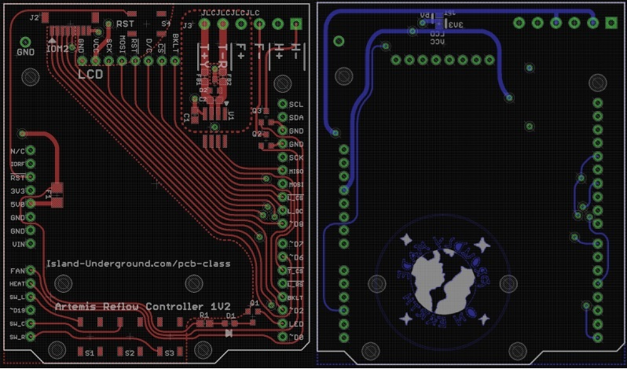
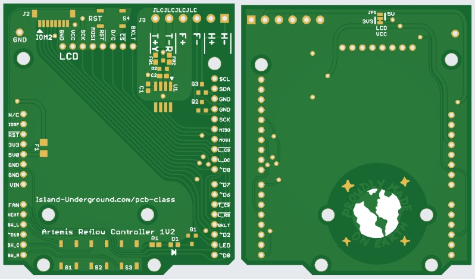

# Toaster Oven Reflow Controller

This project creates a daughterboard for a [Sparkfun Artemis Redboard](https://www.sparkfun.com/products/15444) that acts as a toaster oven reflow controller. The software required to drive the daughterboard is its own Github project, located [here](https://github.com/mookiedog/Reflow).

It is not necessary to use a Redboard with this daughterboard - pretty much any Arduino with the same daughterboard connectors will work. You would need to write your own software though. Honestly, the software can be pretty trivial. The software project for the Redboard is perhaps needlessly complex just so that it can drive a small LCD with lots of information regarding the ongoing reflow process.

If you do not have Eagle, or just want to fabricate a PCB based on this design, a prebuilt zip file exists containing everything required to get the PCB fabricated at [JLCPCB.com](https://jlcpcb.com/). 

As of Feb 2023, the current release version of the reflow controller is 1V2.

To get a PCB built using the zip file, perform the following steps:
1. Download the zip file to your machine
1. Go to the [JLCPCB.com](https://jlcpcb.com/) website.
1. Click on the 'Instant Quote' button
1. Drag the zip file onto the button marked 'Add Gerber File'. There is a button to view the Gerbers. If you click it and then look at the top or bottom layers, you should see something like this:

1. Once the board uploads, you can choose various production options. The default production selections should be just fine, such as:
    1. PCB color
    1. HASL (with lead)

    The only option you might want is for "remove order number": specify 'select location'. This tells JCLPCB to put the order number that JCLPCB silkscreens onto all the boards in an innocuous location. The board files in the zip file already specify where to place the order number so all you need to do is click 'select location'.
1. Click 'save to cart', then go through the order process. It is pretty self-explanitory.

The hardest part is waiting 2 weeks for the boards to arrive!

## Oven

Obviously, you will need a toaster oven to go with this project. I recommend any oven that has 4 heating elements (2 lower, 2 upper) plus a circulating fan. I suspect that pretty much any oven would work, but some small software changes would be required.

# As Always

